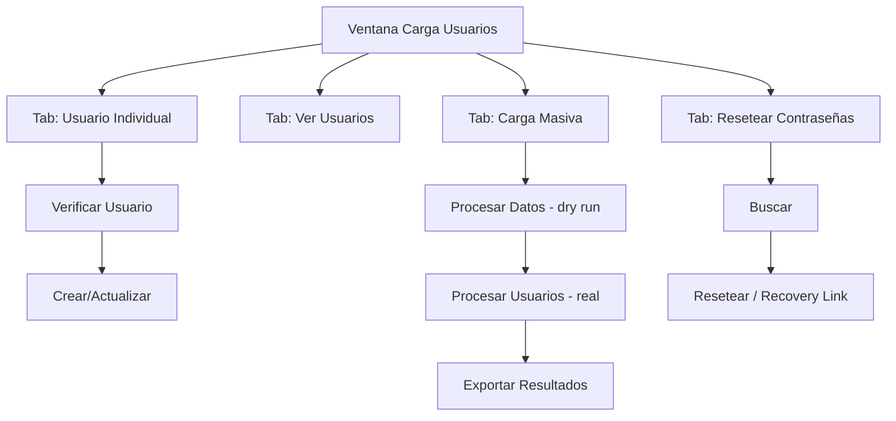

# Creador Masivo de Usuarios — especificación de la interfaz Tkinter

Fuente: `carga maciva usuarios6.0.py` (~3000 líneas, clase
`SupabaseUserCreatorEnhanced`). Ventana con `ttk.Notebook` de **4 pestañas** +
paneles fijos de Estadísticas y Log. Web (si se aprueba): `insevig_web/pages/carga_usuarios/`.

Leyenda: ❌ (nada portado todavía).

---

## Estructura común (fuera de las pestañas)

```
┌───────────────────────────────────────────────────────────────┐
│  [ Notebook: 4 pestañas ]                                      │
├───────────────────────────────────────────────────────────────┤
│ 📊 Estadísticas:  Creados: 0 | Actualizados: 0 | Errores: 0    │
├───────────────────────────────────────────────────────────────┤
│ 📋 Log de Progreso (scrolledtext, append con timestamp)        │
└───────────────────────────────────────────────────────────────┘
```

## Navegación (Mermaid)



---

## Pestaña 1 — "👤 Usuario Individual"  ❌  → `/carga-usuarios/individual`

`ttk.LabelFrame` "Crear/Actualizar Usuario Individual":

| Campo | Tipo | Notas |
|-------|------|-------|
| Email | Entry | clave del usuario en Auth |
| Nombre / metadata | Entry(s) | va a `profiles` |
| Contraseña | Entry (show="*") + toggle 👁 + `🎲 Generar` | `generar_password_segura(8)`, `validar_password` |
| Rol / campos extra | Entry/Combo | según `profiles` |

Botones: `🔍 Verificar Usuario` (`buscar_usuario_por_email_auth`, muestra si
existe en Auth y/o profiles), `👤 Crear/Actualizar` (`crear_usuario_supabase` →
POST Auth + upsert profiles).

---

## Pestaña 2 — "👥 Ver Usuarios"  ❌  → `/carga-usuarios/listado`

`ttk.LabelFrame` "Buscar Usuario Individual" (Entry + `🔍 Buscar`) +
`ttk.LabelFrame` "Gestión de Usuarios":

| Botón | Acción |
|---|---|
| 👥 Listar Todos | merge de Auth (`GET /auth/v1/admin/users`) + `profiles` |
| 📊 Solo Auth | solo `auth.users` |
| 👤 Profiles | solo tabla `profiles` |
| 🔄 Actualizar | refresca |
| 📋 Exportar | CSV de la tabla |

Tabla (`crear_tabla_usuarios`): Treeview con email, nombre, rol, estado, creado,
last sign-in. `tabla_usuarios_data` mapea `item_id → datos`.

---

## Pestaña 3 — "🔄 Resetear Contraseñas"  ❌  → `/carga-usuarios/reset`

- `ttk.LabelFrame` "Resetear Contraseña Individual": Entry email + `🔍 Buscar
  Usuario` + `🔄 Resetear Contraseña` (`resetear_password_usuario`, PUT Auth) +
  `🔧 Recovery Link` (genera link de recuperación) + `🎲 Generar Contraseña`.
- `ttk.LabelFrame` "Resetear Contraseñas Masivo": textarea de emails + `🔄
  Resetear Todas`.
- `ttk.LabelFrame` "Troubleshooting": botones de diagnóstico (métodos
  alternativos de búsqueda de usuario: `buscar_usuario_metodo_alternativo`,
  `buscar_usuario_en_profiles`).

---

## Pestaña 4 — "📊 Carga Masiva"  ❌  → `/carga-usuarios/masivo`

```
┌───────────────────────────────────────────────────────────────┐
│ 📋 Instrucciones (formato esperado del pegado)                 │
├───────────────────────────────────────────────────────────────┤
│ 📊 Datos de Usuarios (Pegar desde Excel)                       │
│   [ ScrolledText: pegar filas email/nombre/password/… ]        │
├───────────────────────────────────────────────────────────────┤
│ ⚙️ Opciones de Procesamiento                                   │
│   ☐ Generar contraseñas   ☐ Actualizar si existe   ☐ …         │
├───────────────────────────────────────────────────────────────┤
│ [🧪 Procesar Datos] [🚀 Procesar Usuarios] [🧹 Limpiar]        │
│ [📁 Cargar CSV] [💾 Exportar Resultados] [🔧 Probar Conexión]  │
└───────────────────────────────────────────────────────────────┘
```

Flujo:
1. **🧪 Procesar Datos** = dry-run: parsea el texto pegado, valida formato,
   muestra en el log qué se crearía/actualizaría/rechazaría (sin escribir).
2. **🚀 Procesar Usuarios** = real: Job por fila (`crear_usuario_supabase`),
   actualiza el panel de Estadísticas en vivo.
3. **💾 Exportar Resultados** = CSV/`.txt` con emails + contraseñas generadas
   (⚠️ contraseñas en claro — decidir el mecanismo de entrega en la web).
4. **📁 Cargar CSV** = `filedialog` para no pegar a mano.

---

## Componentes reutilizables

| Componente | Descripción |
|------------|-------------|
| PasswordField | Entry oculto + toggle 👁 + botón generar + validador |
| PegadoUsuarios | ScrolledText + parser a filas + opción "cargar archivo" |
| LogProgreso | scrolledtext append con timestamp + tags |
| StatsBar | Creados / Actualizados / Errores en vivo |
| UsuariosTable | Treeview Auth+profiles con exportar CSV |

## Paleta

Usa el tema por defecto de `ttk` (no define colores propios más allá de acentos
verde/rojo en el log).

## Checklist paridad

- [ ] 4 pestañas → 4 páginas
- [ ] SERVICE key server-side, nunca en cliente
- [ ] Dry-run antes de la carga real
- [ ] Generación + entrega segura de contraseñas
- [ ] Merge Auth + profiles en el listado
- [ ] Reset individual + masivo + recovery link
