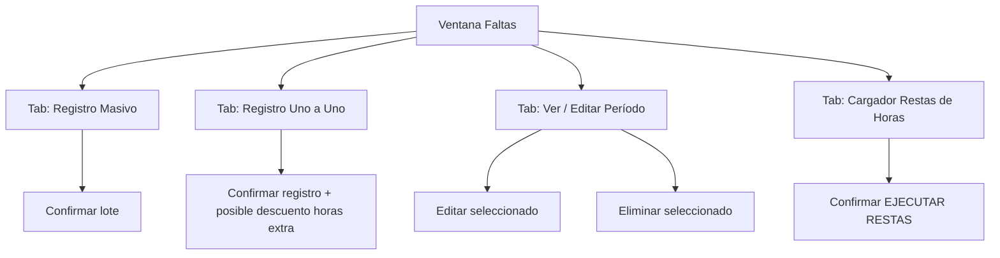

# Gestión de Faltas — especificación de la interfaz Tkinter

Fuente: `gestion_faltas.py` (~3100 líneas). Ventana `Toplevel` con un
`ttk.Notebook` de **4 pestañas**. Web: `insevig_web/pages/faltas/`.

Leyenda: ✅ hecho · 🟡 parcial · ❌ falta. **Todo ❌ hoy** salvo el visor de
lectura que ya existe en `observaciones`.

---

## Estructura común

- Encabezado con título del módulo.
- Todas las pestañas trabajan sobre un **PERÍODO** = (Año, Mes) elegido con dos
  `Spinbox`. La **fecha de vencimiento** se calcula sola = último día del mes
  del período (`faltas_calculo.obtener_fecha_fin_mes`). La **fecha del evento**
  es un día cualquiera dentro del mes.
- Diálogo de confirmación antes de cada escritura (resumen: empleado, tipo,
  horas, período).

## Navegación (Mermaid)



---

## Pestaña 1 — "Registro Masivo"  ❌  → `/faltas/masivo`

Grid de ingreso de hasta 100 filas para pegar faltas/permisos desde Excel.

### Wireframe

```
┌───────────────────────────────────────────────────────────────┐
│ PEGADO MASIVO Ctrl+V | Código | Tipo(FALTA/PERMISO) | Cantidad │
│                      | Fecha(DD/MM/YYYY) | Observación          │
│ ℹ La fecha del evento es cualquier día del mes; el vencimiento │
│   se ajusta al último día del período.                         │
├───────────────────────────────────────────────────────────────┤
│ Período  Año [2026▾] Mes [9▾]   → Vence: 30/09/2026            │
│ [🔥 PEGAR] [✓ VALIDAR] [✔ REGISTRAR TODO] [🗑 LIMPIAR]  stats… │
├───────────────────────────────────────────────────────────────┤
│ Grid de ingreso (scroll vertical)                              │
│  # │ Código │ Nombre │ Tipo │ Cantidad │ Fecha │ Observación   │
│  1 │  1234  │ (auto) │ FALTA│    1     │ 05/09 │ …             │
├───────────────────────────────────────────────────────────────┤
│ Resultado (log con colores ok/error/warn/info)                 │
└───────────────────────────────────────────────────────────────┘
```

### Componentes

| ID | Tipo | Props | Evento → Acción |
|----|------|-------|-----------------|
| anio / mes | Spinbox | 2020–2035 / 1–12 | trace → recalcula "→ Vence:" |
| lbl_fv | Label | texto "→ Vence: dd/mm/aaaa" | — |
| btn_pegar | Button naranja | | Ctrl+V / click → parsea portapapeles (`parse_linea_pegado`) y llena el grid desde la celda activa (`mapear_pegado_a_campos`) |
| btn_validar | Button azul | | resuelve nombre por código, marca filas válidas (`validar_fila_grid_masivo`) |
| btn_registrar | Button verde | | confirmación → Job: por fila `repos.faltas.registrar_falta(...)`; log por fila |
| btn_limpiar | Button gris | | vacía el grid |
| grid | tabla editable | 100 filas, cols #/Código/Nombre/Tipo/Cantidad/Fecha/Observación; Nombre es derivado (readonly) | edición inline por celda |
| txt_log | Text readonly | tags ok/error/warn/info | append por operación |

### Reglas de validación (de `_validar_manual` / `faltas_calculo.validar_fila_grid_masivo`)

- Código numérico existente en `RPEMPLEA`.
- Tipo ∈ {FALTA, PERMISO} (masivo). Cantidad numérica > 0.
- Fecha `DD/MM/YYYY` dentro del mes del período.
- Alerta si `TOTAUS + horas > 48` → "motivo de investigación"
  (`evaluar_alerta_faltas`).

---

## Pestaña 2 — "Registro Uno a Uno"  ❌  → `/faltas/individual`

Formulario individual. Soporta más tipos que el masivo.

### Campos (`_build_tab_uno_a_uno`)

| Label | Tipo | Validación / notas |
|-------|------|--------------------|
| Código | Entry | al salir → busca nombre en `RPEMPLEA`, llena "Nombre" (readonly) |
| Nombre | Entry readonly | derivado |
| Tipo de Registro | Combobox readonly | `FALTA`, `PERMISO`, `SUSPENSIÓN`, `LEVANTAMIENTO SUSPENSIÓN`, `PERMISO MÉDICO` |
| Cantidad | Entry | nº de días/faltas (oculto/omitido para algunos tipos) |
| Fecha del evento | Entry `DD/MM/YYYY` | dentro del período |
| Fecha inicio / Fecha vencimiento (suspensión) | Entry | para SUSPENSIÓN: días = `(fv - fi).days + 1` |
| Observación | Entry/Text | se concatena a la observación existente (`concatenar_observ`) |
| ¿Descontar horas extra? | Checkbutton (SUSPENSIÓN) | si sí → muestra panel de comparación `HOR25/50/100` actuales vs. después, `porcentaje = (días/30)*100` |
| Observación | | |

### Panel "Comparación de Horas" (SUSPENSIÓN con descuento) — `ttk.LabelFrame`

Tabla: concepto | horas actuales | descuento | horas resultantes, para
`HOR25`, `HOR50`, `HOR100`. Individual **acota** con `min(descuento, actual)`
(el masivo no — ver bug en `faltas.md`).

### Acción "Registrar" → confirmación → `repos.faltas.registrar_*` según tipo.

---

## Pestaña 3 — "Ver / Editar Período"  🟡 (visor de lectura ya existe en `observaciones`)  → `/faltas/periodo`

### Controles (`_build_tab_ver`)

| ID | Tipo | Notas |
|----|------|-------|
| anio / mes | Spinbox | |
| fuente | Radiobutton group | **"Período Actual" = `RPHORTOT`** / **"Meses Cerrados" = `RPHORHIS`** |
| btn_cargar | Button | `repos.faltas.listar_periodo(anio, mes, fuente)` |
| btn_editar | Button | **solo activo si fuente = RPHORTOT** |
| btn_eliminar | Button | **solo activo si fuente = RPHORTOT** |
| tabla | Treeview | filas del período: empleado, cédula, nombre, TOTAUS, observación, fecha_ven |

`RPHORHIS` (meses cerrados) es **solo lectura**. Editar/eliminar solo en el
período abierto (`RPHORTOT`).

Diálogo "Editar seleccionado": ajustar `TOTAUS` y/u observación
(`repos.faltas.actualizar_registro`). "Eliminar": confirmación →
`repos.faltas.eliminar_registro`.

---

## Pestaña 4 — "Cargador Restas de Horas"  ❌  → `/faltas/restas`

Proceso batch: quien acumuló **> 3 faltas** en el período pierde horas extra
(`HOR50 → HOR100`, factor 0.75).

### Wireframe

```
┌──────────────────────────────────────────────────────────────┐
│ Carga FALTAS_PARA_RESTA.xlsx → calcula HOR50/HOR100 →         │
│ confirma → actualiza RPEMPLEA                                 │
├──────────────────────────────────────────────────────────────┤
│ Año [2026▾] Mes [9▾]  Archivo [ ...FALTAS_PARA_RESTA.xlsx ][…]│
│ [CARGAR Y CALCULAR] [EJECUTAR RESTAS] [Restaurar Respaldo]    │
├──────────────────────────────────────────────────────────────┤
│ Resultado: N empleados con >3 faltas, …                       │
├──────────────────────────────────────────────────────────────┤
│ Tabla: emp│ced│nombre│faltas│HOR50 ant│HOR50 nuevo│HOR100 ant │
│        │HOR100 nuevo│estado                                   │
└──────────────────────────────────────────────────────────────┘
```

### Flujo

1. **CARGAR Y CALCULAR** (`_cargar_resta`): lee el Excel
   (`repos.faltas.leer_excel_faltas`), cuenta faltas por cédula del período
   (`contar_faltas_por_cedula`), cruza con `RPEMPLEA`, calcula nuevos
   `HOR50`/`HOR100` (`calcular_resultados_resta`, `max_faltas=3`), **solo
   previsualiza** en la tabla.
2. **EJECUTAR RESTAS** (`_ejecutar_restas`, botón rojo): confirmación → respaldo
   (`guardar_respaldo`) → `repos.faltas.aplicar_resta_horas(..., ejecutar=True)`
   por empleado → Job + reporte Excel (`generar_excel_periodo`).
3. **Restaurar Respaldo**: recupera un respaldo JSON previo y revierte.

---

## Componentes reutilizables detectados

| Componente | Descripción | Pestañas |
|------------|-------------|----------|
| PeriodoPicker | Spinbox Año + Mes + etiqueta "→ Vence: fin de mes" | 1, 2, 3 |
| GridPegado | Grid editable N filas, pega TSV desde portapapeles, Validar + resumen | 1 (y comparte lógica con maniobras) |
| EmpleadoLookup | Entry código → resuelve nombre desde `RPEMPLEA` | 2 |
| ComparadorHoras | Tabla HOR25/50/100 actual vs. resultante | 2 (suspensión), 4 |
| LogConsola | Text readonly con tags de color ok/error/warn/info | 1 |
| ConfirmDialog | Resumen + Confirmar/Cancelar antes de escribir | todas |

## Paleta (de `gestion_faltas.py`)

| Token | Valor | Uso |
|-------|-------|-----|
| header | `#17375e` | encabezados, botones primarios |
| success | `#27ae60` | REGISTRAR TODO, ok |
| danger | `#c0392b` | EJECUTAR RESTAS, error |
| warn | `#e67e22` | PEGAR, advertencias |
| bg | `#f0f4f8` | fondo |
| grid_h | `#e8f0f7` | fondo de instrucciones |

## Checklist paridad

- [ ] 4 pestañas → 4 páginas Reflex
- [ ] PeriodoPicker con cálculo de vencimiento automático
- [ ] Grid de pegado con Validar + resumen del lote
- [ ] Toggle RPHORTOT/RPHORHIS con editar/eliminar deshabilitados en histórico
- [ ] Panel de comparación de horas en suspensión
- [ ] Confirmación + respaldo antes de toda escritura
- [ ] Cargador de restas: previsualiza → confirma → ejecuta → reporte
- [ ] Mismos textos de error/alerta ("motivo de investigación", etc.)
