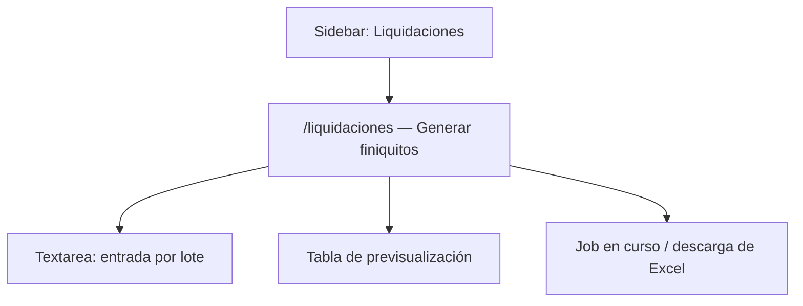

# UX/UI Spec: liquidaciones

> Alcance de este documento: la única pantalla que existe hoy en
> `insevig_web/pages/liquidaciones/` (entrada por lote → Excel). El `.pyw`
> original (`Generador_Liquidaciones_INSEVIG.pyw`) tiene además un Editor de
> Liquidaciones, una Gestión de Liquidaciones, generación de PDF individual y
> un exportador al formato del bot RPA MRL -- ninguna de esas 4 pantallas
> tiene todavía una página Reflex equivalente (ver "Pendiente" en
> `docs/modulos/liquidaciones.md`); no se documentan aquí como wireframes
> porque no hay UI que describir aún, solo la lógica ya portada a
> `nucleo_modular/` lista para trasplantar cuando se aborden.

## Mapa de navegación



## Pantalla: Generador de liquidaciones — Ruta: `/liquidaciones`

**Origen**: `Generador_Liquidaciones_INSEVIG.pyw` → pantalla principal, modo
"Lote" (entrada de texto `cédula, fecha, motivo` una línea por empleado) +
botón "Generar Liquidaciones". El modo "PDF individual", el Editor y la
Gestión de Liquidaciones del `.pyw` no tienen equivalente en esta página.

### Wireframe textual

```
┌──────────────────────────────────────────────────────────┐
│ Generador de liquidaciones (finiquitos)                  │
│ Cálculo legal: vacaciones, décimo 13/14, desahucio, ...   │
├──────────────────────────────────────────────────────────┤
│ Región: [COSTA ▾]                                         │
│ ┌────────────────────────────────────────────────────┐   │
│ │ 0920116811, 15/02/2026, RENUNCIA VOLUNTARIA         │   │
│ │ 1712345678, 28/02/2026, DESPIDO INTEMPESTIVO        │   │
│ │                                                      │   │
│ └────────────────────────────────────────────────────┘   │
│ [Previsualizar]           [Generar Excel]                 │
├──────────────────────────────────────────────────────────┤
│ Empleado│Nombre│Motivo│Días│Ingresos│Descuentos│A recibir│Error│
│ ──────────────────────────────────────────────────────── │
│  1012   │PEREIRA...│RENUNCIA│1127│$1500│$200│$1300│      │
├──────────────────────────────────────────────────────────┤
│ [Job: corriendo/pendiente/ok/error] [Cancelar] [Descargar]│
└──────────────────────────────────────────────────────────┘
```

### Componentes

| ID | Tipo | Props | Evento → Acción |
|----|------|-------|-----------------|
| region | `rx.select` | `["COSTA","SIERRA"]`, default `COSTA` | `on_change` → `set_region` |
| entrada | `rx.text_area` | placeholder con 2 líneas de ejemplo, `rows=6` | `on_change` → `set_entrada` |
| btn_previsualizar | `rx.button` (soft) | "Previsualizar" | `on_click` → `previsualizar` (síncrono, sin job) |
| btn_generar | `primary_button` | "Generar Excel" | `on_click` → `generar_excel` (encola job en background) |
| tabla | `rx.table` | columnas Empleado/Nombre/Motivo/Días/Ingresos/Descuentos/A recibir/Error | sin interacción por fila (solo lectura) |
| job_progress | `components.job_progress` | status/mensaje/cancelar/descargar | `on_cancelar`/`on_descargar` |

### Estados de pantalla

| Estado | UI | Trigger |
|--------|-----|---------|
| inicial | textarea vacía, sin tabla, sin job | `on_load` |
| previsualizado | tabla con filas (puede incluir filas con `Error` si la línea/cédula es inválida) | `previsualizar` resuelto |
| generando | `job_progress` visible, estado "pendiente"/"corriendo" | `generar_excel` → job encolado |
| listo | `job_progress` con botón "Descargar" habilitado | job en estado `ok` |
| error | `job_progress` con mensaje de error | job en estado `error` |

No hay diálogos/modales en esta pantalla (a diferencia del `.pyw`, que sí
tiene varios: selector de carpeta, confirmación de sobrescritura, diálogo de
fecha de ingreso cuando `FECHA_ING > FECHA_SAL` -- ninguno portado aún, ver
"Pendiente" en `docs/modulos/liquidaciones.md`).

## Componentes reutilizables usados (del design system, no propios del módulo)

| Componente | Descripción |
|------------|-------------|
| `components.layout.pagina` | envoltura obligatoria con control de permiso (`requiere=("liquidaciones","ver")`) |
| `components.ui.card/page_heading/primary_button/scroll_x` | tarjeta, título, botón primario, contenedor con scroll horizontal para la tabla |
| `components.job_progress` | barra/estado de una operación en background (`core.jobs`), con cancelar/descargar |

## Responsive

Hereda el comportamiento genérico de `components.layout`/`theme` (sidebar
colapsable <1024px, tablas con `scroll_x` para no desbordar en móvil). No hay
ajustes específicos de este módulo más allá de eso -- la tabla de
previsualización es la única superficie ancha.

## Checklist de paridad con el `.pyw`

- [x] Modo "Lote" (texto → Excel de 62/63 columnas)
- [x] Región COSTA/SIERRA
- [ ] Modo "PDF individual" (existe en `nucleo_modular/generacion_pdf.py`, no en una página)
- [ ] Editor de Liquidaciones (guardar/editar/eliminar en Supabase)
- [ ] Gestión de Liquidaciones (buscar, filtrar, exportar Bot MRL)
- [ ] Diálogo de fecha de ingreso cuando `FECHA_ING > FECHA_SAL` (aquí: error de texto en la fila)
- [ ] Vista con desglose mensual de vacaciones/décimos ("mostrar insumos del cálculo")
