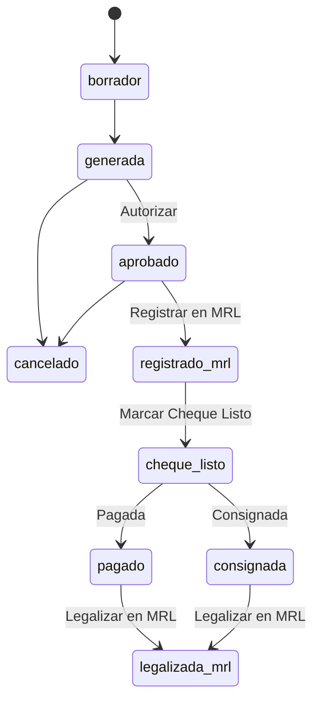

# UX/UI Spec: Gestión de Liquidaciones (paridad con el `.pyw`)

> Fuente: `Generador_Liquidaciones_INSEVIG.pyw`, método
> `_abrir_pantalla_pagos` (líneas ~12230-14676, ~2450 líneas) del repo
> `LIQUIDACIONES_SISTEMA_INSEVIG`. Cada sección de abajo dice si está
> **verificada línea por línea** o **inferida/parcial** -- no se inventó
> ningún campo o botón que no se haya visto en el código.
>
> Este documento es la base para construir `insevig_web/pages/
> liquidaciones/guardadas.py` (o una página nueva) a paridad completa,
> según lo pedido por el usuario el 2026-09-08 ("no acotar por lo que se
> usa o no... quiere paridad completa con la interfaz Tkinter").

## Contexto importante antes de implementar

**El flujo de estados de abajo existe en el código pero casi no se usa en
producción.** Verificado contra los datos reales (4101 filas, 2026-09-08):
solo hay `'generada'` (198) y `'pagado'` (3903) -- cero filas en
`aprobado`/`registrado_mrl`/`cheque_listo`/`consignada`/`legalizada_mrl`/
`impreso`/`archivado`/`cancelado`/`borrador`. El usuario pidió paridad
completa de todos modos; el motor (`core/repos/liquidaciones.py`, commit
`02acb92`) ya expone las funciones de transición y `TRANSICIONES`.

## Layout general de la pantalla

Ventana `Toplevel` con barra lateral (`_crear_barra_lateral`, compartida
con el resto de la app) + contenido en dos zonas:
1. **Panel izquierdo** (mayor ancho): encabezado, filtros, tabla, barra de
   acciones inferior.
2. **Panel derecho** (`detalle_contenido`): aparece al seleccionar UNA
   fila -- si se seleccionan varias, este panel no se actualiza (las
   acciones en lote se disparan desde la barra inferior, no desde acá).

## Encabezado

`"Gestión de Liquidaciones"` (título, 17pt bold) + etiqueta de conteo
dinámica (`etiqueta_conteo`, ej. "42 liquidaciones").

## Filtros (verificado línea por línea)

| Control | Tipo | Detalle |
|---|---|---|
| "Filtrar por:" | Chips de estado | Igual patrón que Descuentos Pendientes -- botones tipo pill, uno resaltado a la vez |
| Búsqueda | Campo de texto único | "Buscar por cédula, nombre o código de lote" -- un solo input, detecta automáticamente si es cédula/código o texto libre |
| "Lote:" | Combobox | Lista de códigos de lote existentes + opción "Todos"; junto a un botón **⟳** (refrescar la lista de lotes) y una etiqueta de conteo ("N liquidaciones en este lote") |
| "Desde" / "Hasta" | Selector de fecha (DateEntry si `tkcalendar` está disponible, si no `Entry` con texto) | Rango sobre `fecha_salida`; botón **"Aplicar filtro"** aparte (no filtra en vivo al tipear) |
| "Ordenar por:" | Combobox | Columna de orden -- no se leyó la lista exacta de opciones, inferir de las columnas de la tabla (ver abajo) |

## Tabla (verificado línea por línea)

`ttk.Treeview` con scroll vertical Y horizontal (10 columnas suman más
ancho del que entra en la ventana). Columnas exactas, en este orden:

| Clave | Encabezado | Ancho (ref.) |
|---|---|---|
| `cedula` | Cédula | 105 |
| `nombres` | Nombres | 200 |
| `lote` | Lote | 90 |
| `estado` | Estado | 90 |
| `fecha_ingreso` | Fecha Ingreso | 95 |
| `fecha_salida` | Fecha Salida | 95 |
| `dias` | Días | 55 |
| `fecha_registro` | Fecha Registro | 95 |
| `total` | Total | 95 |
| `pago` | Info de pago | 180 |

**Resaltado de filas (tags), todo por color de fondo/texto, no por
columna extra:**
- `color_<hex>`: si la liquidación tiene `color_etiqueta` asignado (ver
  panel de detalle), la fila entera se tiñe con ese color mezclado al 80%
  con el fondo normal.
- `estado_generada`: tinte automático (color de advertencia mezclado al
  82%) para toda fila en estado `'generada'` -- "todavía no tiene cheque
  ni autorización, conviene que resalte sin asignar color a mano".
- `total_negativo`: texto en rojo y negrita si el total a pagar es
  negativo (el empleado le debe a la empresa más de lo que se le debe a
  él, ej. préstamos que superan los beneficios).

Doble clic en una celda de texto (al menos `pago`/`nota_pago`, posiblemente
`observaciones`) abre un diálogo rápido "editar nota" (`Text` de varias
líneas + Cancelar/Guardar) sin necesidad de abrir el panel de detalle
completo.

## Acciones por fila (verificado línea por línea) -- el corazón del flujo

**El botón de acción disponible depende del `estado` de la fila
seleccionada** (no de una pestaña/filtro fijo -- el listado mezcla todos
los estados y cada fila puede necesitar una acción distinta). Solo se
puede aplicar EN LOTE (varias filas a la vez, un solo diálogo) si todas
las seleccionadas comparten el mismo estado Y ese estado está en
`ACCIONES_EN_LOTE = {generada, aprobado, registrado_mrl, cheque_listo,
pagado, consignada}`.

| Estado de la fila | Botón/acción | Diálogo | Función del motor ya lista |
|---|---|---|---|
| `generada` | "✔ Autorizar" | Confirmar autorización | `autorizar(id, autorizado_por=..., usuario=..., roles=...)` |
| `aprobado` | "📋 Registrar en MRL" | Genérico (solo "Responsable") | `avanzar_estado(id, "registrado_mrl", responsable=..., ...)` |
| `registrado_mrl` | "🖊 Marcar Cheque Listo" | Forma de pago + cheque/comprobante | `marcar_cheque_listo(id, forma_pago=..., comprobante_pago=..., ...)` |
| `cheque_listo` | "💳 Marcar Pagada/Consignada" | Fecha + botones "Consignada"/"Pagada" separados | `marcar_consignada`/`marcar_pagada(id, fecha=..., ...)` |
| `pagado` | "⚖ Legalizar en MRL" | Genérico (solo "Responsable") | `avanzar_estado(id, "legalizada_mrl", responsable=..., ...)` |
| `consignada` | "⚖ Legalizar en MRL" | (mismo diálogo que arriba) | ídem |

Sin selección: `messagebox` "Seleccione una o más liquidaciones... (Ctrl o
Shift para elegir varias)".

### Diálogo "Confirmar autorización" (verificado)
Campo: **Autorizado por** (texto libre, obligatorio). Botones: Cancelar /
Confirmar autorización. Al confirmar (en lote: aplica a todas las
seleccionadas, junta errores por cédula si alguna falla): mensaje
`"La liquidación quedó autorizada" / "Las N liquidaciones quedaron
autorizadas"`, + `"pasan a 'Pendientes de Registro en MRL'"`.

### Diálogo genérico de avance (verificado, `_abrir_dialogo_avance`)
Título y texto de confirmación parametrizados (usado para "Registrar en
MRL" y "Legalizar en MRL"). Campo: **Responsable** (texto libre,
obligatorio). El texto guardado se **ANEXA** a `observaciones` (nunca la
pisa): `"{texto_confirmacion} por {responsable} el {fecha dd/mm/aaaa
HH:MM}."`. Botones: Cancelar / Confirmar.

### Diálogo "Marcar Cheque Listo" (verificado)
Título dinámico: nombre del empleado (individual) o "N liquidaciones
seleccionadas" (lote). Si es individual, muestra "Total a pagar: $X.XX".
Campos: **Forma de pago** (combobox: `FORMAS_PAGO`, valores no
confirmados con certeza -- inferir de `['Transferencia', 'Cheque',
'Efectivo', 'Otro']`, que es la lista usada en el panel de detalle para
el mismo concepto); **Número de cheque/comprobante** (Entry, SOLO visible
si es una sola liquidación -- en lote queda en blanco a propósito, "cada
cheque tiene su propio número", se completa después desde el panel de
detalle). Validación: si es individual, el comprobante es obligatorio.

### Diálogo "Marcar como Pagada o Consignada" (verificado)
Campo: **Fecha** (DateEntry si `tkcalendar` disponible, si no texto
dd/mm/aaaa). Dos botones de confirmación **separados** (no un solo
"Confirmar"): **"Consignada"** (color de advertencia) → estado
`consignada`; **"Pagada"** (color primario) → estado `pagado`. Ambos
graban la misma fecha en `fecha_pago`. Mensaje final: "La liquidación se
marcó como {consignada|pagada}" (singular/plural según selección).

## Panel de detalle (al seleccionar UNA fila)

Verificado línea por línea. De arriba hacia abajo:

1. **Encabezado**: nombre (bold, 12pt), metadatos (fecha, lote, etc. --
   línea con formato `"{forma_pago} · {comprobante o '—'}"`... más el
   lote), **total grande** ($, 18pt bold).
2. **ESTADO** (bold, label de sección) -- muestra el estado actual; el
   botón de acción por-estado descrito arriba vive acá o en la barra
   inferior (confirmar al implementar cuál).
3. **DESGLOSE** (bold, label de sección) -- lista de conceptos
   (`liquidaciones_detalle`) con **"TOTAL DE INGRESOS"** y **"TOTAL DE
   EGRESOS"** como subtotales separados (no un solo total neto).
4. **COLOR** (bold, label de sección) -- fila de botones-swatch (uno por
   color de `COLORES_ETIQUETA`) + un botón "✕" para quitar el color. Es
   un marcador libre por liquidación, sin significado fijo (para uso
   interno del equipo).
5. **SEGUIMIENTO DE FIRMA Y COBRO** (bold, label de sección) -- campos
   (todos opcionales, independientes del estado):
   - **Cuándo se acercó o se consignó la liquidación** (fecha) →
     `fecha_consignacion`
   - **Lugar donde firma la liquidación** (combobox: `['Consignación',
     'Oficina']`) → `lugar_firma`
   - **Forma de pago** (combobox: `['Transferencia', 'Cheque',
     'Efectivo', 'Otro']`) → `forma_pago`
   - **Cheque # / comprobante** (Entry) → `comprobante_pago`
   - **Banco** (Entry) → `banco`
   - (hay más campos de fecha con nombres inferidos por la función
     `_campo_fecha`, no confirmados uno por uno: `fecha_firma_acuerdo`
     "firma de acuerdo", `fecha_lista_cobro` "lista para cobro",
     `fecha_citado_cobro` "citado para cobro" -- estas tres existen como
     columnas reales, confirmar el label exacto de cada campo al
     implementar si hace falta.)
   - **Número de acta** (Entry) → `numero_acta`
6. **OBSERVACIONES** (bold, label de sección) -- `Text` libre de 5 líneas
   → `observaciones`.
7. **HISTORIAL DE ESTADOS** (bold, label de sección) -- timeline de
   cambios de estado con fecha exacta (no solo el estado actual). Ya
   tiene función lista: `historial_estados(id)`.
8. **Botón "💾 Guardar todo (color, seguimiento y observaciones)"** --
   guarda TODO lo de los puntos 4-6 en una sola llamada, sin tocar el
   estado. Función lista: `guardar_seguimiento(id, campos, usuario=,
   roles=)`.

## Barra de acciones inferior (toolbar, verificado línea por línea)

| Botón | Acción |
|---|---|
| 🔄 Actualizar | Recarga la tabla con los filtros actuales |
| ⬇ Exportar a Excel | Exporta el listado FILTRADO completo (no una liquidación individual) -- función lista: `listado_liquidaciones_xlsx(filas)` en `core/excel/liquidaciones_builders.py` |
| 🖨 Imprimir PDF/Excel | Genera el reporte de la(s) liquidación(es) seleccionada(s) (mismo `generar_pdf_individual`/`generar_excel_simulacion` que el Editor) |
| 🗑 Eliminar | Pide **motivo de eliminación** (obligatorio) + advertencia "Esta acción no se puede deshacer, pero queda un registro" -- guarda snapshot en `liquidaciones_eliminadas_historial` antes de borrar (ya portado: `eliminar_liquidacion`) |
| ✎ Abrir / Editar | Abre el Editor de Liquidaciones para esa fila |
| 🤖 Formato Bot MRL | Ya portado (`core/excel/liquidaciones_bot_mrl.py`) |
| ▦ Editar en cuadrícula | Edición masiva de varias filas a la vez -- pantalla aparte (~577 líneas, `_abrir_cuadricula_edicion_masiva`), NO detallada en este doc (queda para el final según lo acordado) |
| 🧮 Cuadre masivo (MRL) | Ajuste de cuadre en lote -- pantalla aparte (~248 líneas, `_abrir_carga_masiva_ajuste_cuadre`), NO detallada en este doc |
| ✔ Autorizar | Mismo diálogo de "Confirmar autorización" de arriba, disponible también desde acá para selección múltiple |

## Diagrama de flujo de estados

`impreso`/`archivado` no aparecen en este diagrama -- existen como valor
posible de `estado` (`ESTADOS_AVANZADOS` del `.pyw`) pero no se encontró
su disparador real en el código leído.

## Lo que este documento NO cubre (a propósito, por orden de prioridad acordado)

- **Editar en cuadrícula** (`_abrir_cuadricula_edicion_masiva`, ~577
  líneas): edición de conceptos de varias liquidaciones a la vez en una
  grilla tipo Excel.
- **Cuadre masivo (MRL)** (`_abrir_carga_masiva_ajuste_cuadre`, ~248
  líneas): carga masiva de un ajuste de cuadre.

Si se necesita el detalle de estas dos pantallas, pedirlo aparte -- son
grandes y el usuario ya priorizó el panel de detalle + flujo de estados +
filtros primero.
